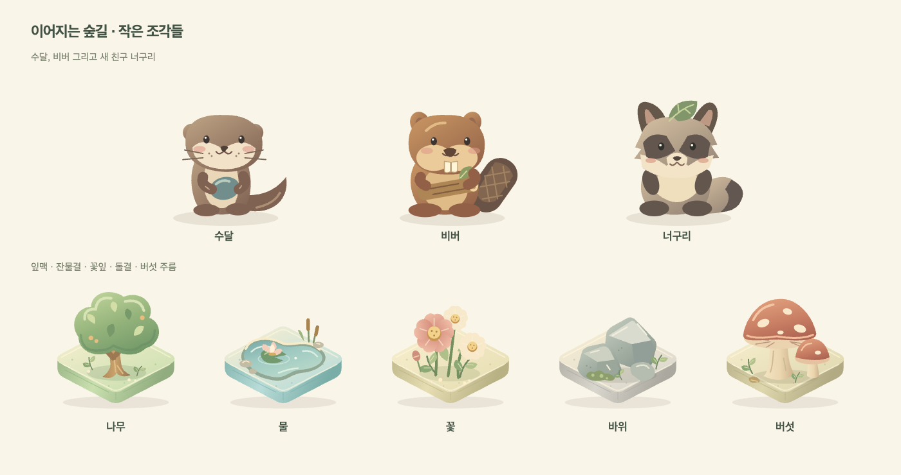
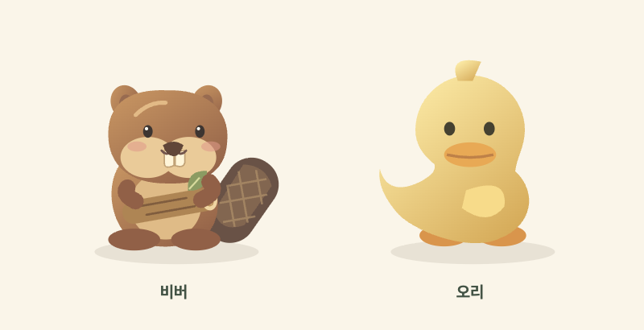
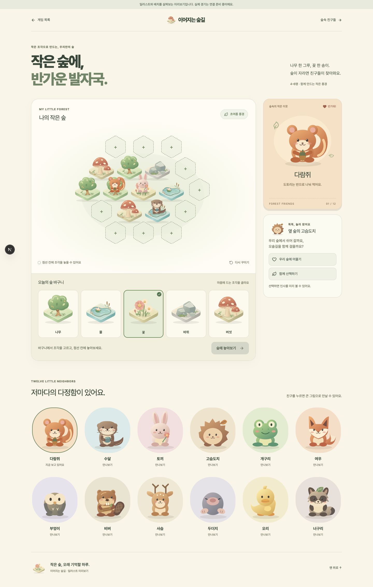

# 이어지는 숲길 · SVG 일러스트와 화면 미리보기

Updated: 2026-09-05
Status: ASSET LIBRARY + VISUAL PREVIEW — 실제 게임에서도 SVG 자산 사용

## 확인 결과

기존 구현은 도메인 로직만 있었고 실제 동물 SVG 또는 게임 UI는 없었다. `connected-forest-sketch.html`은 무채색 와이어프레임이었다. 사용자의 SVG 일러스트 보완 요청에 따라 재사용 가능한 벡터 자산과 별도 화면 미리보기를 추가했다.

- URL: `/preview/connected-forest`
- SVG 자산: `src/modules/connected-forest/ui/forest-art.tsx`
- 반응형 화면: `src/modules/connected-forest/ui/art-preview.tsx`, `art-preview.module.css`
- 브라우저 회귀 테스트: `tests/e2e/connected-forest-preview.spec.ts`

## 미술 기준

크림색 종이와 이끼색 바탕에 둥근 실루엣, 작은 눈, 홍조, 부드러운 그라데이션을 사용한다. 점토 미니어처의 따뜻한 인상을 가벼운 SVG로 표현한다. 라스터 그림·이모지·외부 이미지 요청은 없다.

12종을 각각 구분되는 모양으로 그렸다. 다람쥐는 큰 꼬리와 도토리, 토끼는 긴 귀와 꽃, 여우는 뾰족한 귀와 흰 꼬리 끝, 고슴도치는 가시와 낙엽, 수달은 수염과 조약돌, 비버는 앞니와 납작한 꼬리로 구분한다. 개구리·부엉이·사슴·두더지·오리·너구리도 별도 실루엣을 가진다.

나무·물·꽃·바위·버섯 지형 5종은 같은 조명 방향과 두께를 가진 조각으로 표현한다. 카드와 보드 위 토큰에서 같은 SVG 컴포넌트를 사용한다. 색상만으로 선택을 알리지 않고 체크 표시·테두리·`aria-pressed`를 함께 제공한다.

## 9월 5일 일러스트 보완

사용자 피드백에 따라 수달·비버의 공통 몸통과 큰 원형 귀를 없애고 종별 실루엣을 다시 그렸다.

- 수달: 낮고 작은 귀, 길쭉한 몸통, 끝으로 갈수록 가늘어지는 꼬리, 볼의 수염과 두 손에 쥔 조약돌.
- 비버: 넓은 볼과 주둥이, 두 앞니, 격자 결의 노 모양 꼬리, 새잎이 난 통나무.
- 기존 겨울잠쥐는 너구리로 교체: 눈가 무늬, 볼 털, 짙은 발과 꼬리 끝, 머리 위 나뭇잎. 내부 ID도 `tanuki`로 변경했다. 북미 라쿤의 고리무늬 꼬리는 사용하지 않는다.
- 나무: 비대칭 수관, 잎맥, 열매, 가지와 뿌리.
- 물: 타일 면을 따르는 오목한 연못, 밝은 가장자리, 수련·갈대·잔물결.
- 꽃: 5장 꽃잎의 겹침과 꽃술, 높이가 다른 꽃과 봉오리, 작은 잎.
- 바위: 밝고 어두운 면으로 나눈 돌, 이끼와 틈새 식물.
- 버섯: 둥근 갓의 명암과 반점, 갓 아래 주름, 줄기 결과 작은 버섯.

받침은 기존보다 얇게 만들고 모서리에 밝은 선을 넣었다. 색 수를 늘리기보다 같은 재료 안의 명암으로 입체감을 낸다. 확대 그림뿐 아니라 모바일 바구니와 보드 위 작은 크기에서도 실루엣을 확인했다.

너구리의 지형 조건과 카드 수는 이전 캐릭터와 같다. TypeScript 콘텐츠·Python 시뮬레이터·현행 설계 문서를 함께 변경하고 Python golden fixture를 재생성했다. 과거 설계 기록은 수정하지 않았다.

### 추가 조정: 비버 앞니와 오리 목선

비버 앞니를 입 바로 아래로 올리고 약간 줄여 주둥이와 연결했다. 오리는 분리된 머리 원과 몸통을 하나의 연속된 윤곽으로 바꿔 목의 겹침과 색 경계를 없앴다. 다른 동물과 지형은 변경하지 않았다. 실제 브라우저에서 확대 그림과 모바일 크기를 확인했고 런타임 오류 없이 렌더링되었다.

## 미리보기 동작

- 19칸 보드에서 지형 선택 → 인접 빈칸 선택 → 놓아보기 → 초기화.
- 동물 12종 선택 시 큰 일러스트와 소개 변경. 작은 화면에는 갤러리 아래에도 선택 결과 표시.
- 고슴도치 방문의 머물기·산책하기 두 선택과 인사 표시.
- 샘플 풍경이며 점수·타이머·방 입장·서버 전이는 시뮬레이션하지 않는다. 실제 경기로 오인하지 않도록 상단 안내를 유지한다.

## 검증

- 실제 브라우저에서 수정 전 와이어프레임과 수정 후 desktop/mobile 화면 확인.
- 375·768·1024·1440px 가로 넘침 없음, 활성 버튼 44px 미만 없음.
- SVG ID 중복, 잘못된 path, hydration, 브라우저 runtime 오류 없음.
- 키보드 Enter로 빈칸 선택·배치, 동물 선택, 방문 선택, 초기화 확인.
- reduced-motion 모드에서 레이아웃과 조작 확인.
- 새 캐릭터 3종 선택 및 모든 SVG의 색상 참조가 자기 SVG 안의 정의를 가리키는지 회귀 테스트에 추가했다.
- Playwright 데스크톱·모바일 총 6개 테스트 통과. 현재 로컬 dev 서버는 `127.0.0.1` HMR 연결에 오류가 있어 `localhost:3000` baseURL로 검증했다.

[모바일 전체 화면](./assets/connected-forest-art-mobile.png)

## 남은 완료 조건

미리보기 자체는 샘플 풍경이다. 2026-10-08에 동일한 SVG를 실제 공개·개인 게임 화면에 적용하고 방·런타임·행동 API와 연결했다. 구현·전체 경기 검증은 [디지털 게임 연결 문서](./connected-forest-game.md)를 따른다. 보상 확정과 사람 플레이테스트는 별도 검증 조건이다.
