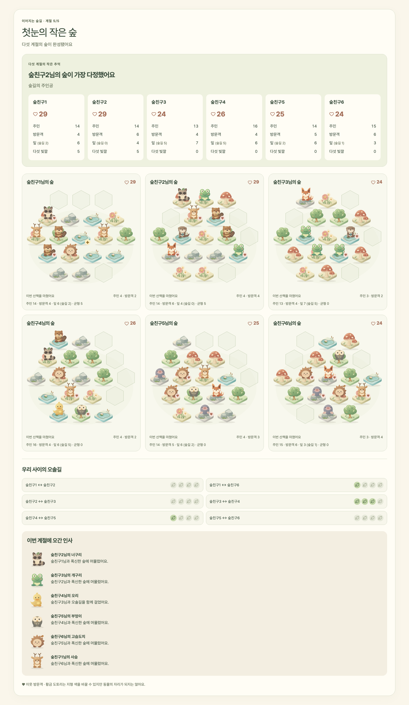
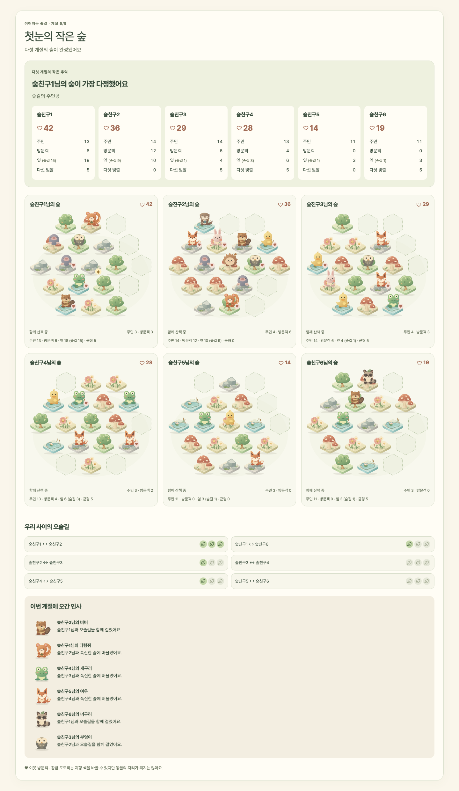

# 이어지는 숲길 · 디지털 게임 연결

Updated: 2026-10-08
Status: DIGITAL PLAYTEST READY — 전체 경기 구현·production 검증 완료

## 플레이 범위

홈의 **나의 숲 만들기**에서 방을 만들고 초대 링크나 QR로 4–6명이 참가한다. 호스트가 첫 계절을 시작하면 개인 숲에 지형을 세 번 놓고 이웃에게 바구니를 전달한다. 동물을 맞이하고 이웃 방문을 해결하며 다섯 계절을 진행한다. 마지막 방문 뒤 최종 점수와 승자를 표시하고 같은 방에서 재경기할 수 있다.

9월에 승인된 SVG 자산을 재사용한다. 수달·비버·너구리 보완과 비버 앞니·오리 목선 수정도 실제 게임에 적용되어 있다.

## 구현 연결

- 카탈로그·저장 게임 판별자에 `connected-forest`를 등록했다. 최소 4명, 최대 6명이다.
- 런타임의 생성·시간 전이·행동·공개 투영·개인 투영을 기존 순수 reducer에 연결했다.
- HTTP 행동은 Zod의 strict schema로 검사하며, 동물 ID는 48장 콘텐츠 목록을 기준으로 검증한다. 공유 `CLAIM_FORFEIT`은 게임 판별자로 분리한다.
- 룸의 저장 revision 비교·교환과 `{ clientActionId, expectedVersion }` 계약을 재사용한다. 같은 pick의 동시 제출로 발생한 stale 응답만 같은 행동 ID·payload로 재시도한다. phase가 바뀌거나 방문 ID가 달라졌으면 재시도하지 않는다.
- 새 경기에는 서버가 만든 고유 `matchId`를 저장한다. 공개·개인 투영의 opaque `phaseKey`에 이를 포함하고 재시도에서도 경기 ID를 대조하므로, 같은 카드·계절 번호가 반복되는 재경기에 이전 선택이나 미제출 초안이 넘어가지 않는다. 경기 ID가 없는 기존 저장 판의 투영은 그대로 유지한다. 점수·드래프트·방문 규칙의 reducer와 밸런스 엔진은 변경하지 않았다.
- 메모리와 Supabase 저장소 모두 기존 `StoredGame` 직렬화를 사용한다. 새 테이블이나 비밀 payload가 포함된 Realtime 이벤트는 추가하지 않았다.

## 화면

개인 화면은 19칸 숲, 현재 지형 손, 동물 서식지 2장, 배치 미리보기, 합법 배치 칸, 서식지 회전, 완성 동물 자리 선택을 제공한다. 황금 도토리는 지정한 지형으로 바꾸고, 계절 첫 pick에는 1회 교환권을 사용할 수 있다. 두 도구는 접힌 영역에 둔다.

방문 보내기 화면에서 주민과 좌우 이웃을 고른다. 받은 방문은 자기 큐의 타이머와 합법 머물기 자리·산책 가능 여부만 보여 준다. 완료 뒤 이번 계절의 방문 타임라인을 표시한다.

휴대폰 공개 화면은 본인과 좌우 이웃의 숲을 확대하고 나머지는 점수와 주민 수로 요약한다. TV는 모두의 숲을 표시한다. 현재 점수는 주민·방문객·잎·다섯 빛깔이며 잎에는 숲길 몫을 함께 표기한다. 최종 순위와 동률 처리는 reducer 점수 함수를 따른다.

효과음은 **작은 숲 소리 켜기**를 직접 누른 뒤에만 재생한다. 별도 파일·외부 요청 없이 짧은 Web Audio 음을 사용하고 숨겨진 탭에서는 재생하지 않는다. 방문 결과의 작은 등장 모션은 reduced-motion에서 제거한다.

## 비밀 정보와 복구

공개 투영은 실제 적용된 숲·피규어·점수·준비 여부만 허용한다. 지형 덱·동물 덱·손·활성 서식지·잠금 payload·다른 수신자의 큐는 내보내지 않는다. 개인 투영은 요청자 본인의 비밀만 추가한다. display token으로 개인 모드를 요청해도 공개 데이터만 반환한다.

미제출 선택은 공개 화면 전환, 자동 가림, 같은 pick의 polling 동안 유지된다. 새로고침하면 미제출 초안은 초기화되지만 서버에 잠근 선택은 복구된다. 다음 pick에서는 초안을 새로 시작한다.

현재 입력이 필요한 좌석이 끊기면 전체 deadline을 보관한다. 재접속 시 정지 시간만큼 보정한다. 3분 후 연결된 참가자가 청구하면 승자 없이 마친다. 다시 4명 이상이 모이면 재경기한다. 경기 중 roster와 원형 이웃은 바꾸지 않는다.

## 검증

- 공개·개인 투영: 잠금 전 배치·카드 비노출, display 권한, 큐·타이머 분리, 깊은 복사.
- 룸 서비스: 4·5·6인 다섯 계절 전체 경기, 최종 점수 일치, 4명 미만·7번째 참가·호스트 권한, STAY/WALK, 중복·stale, 일시정지·재접속·무승 종료·재경기.
- React 조작: 미제출 선택의 가림·복원, 동시 잠금 재시도, 이전 pick 재전송 차단, 합법 방문 선택.
- Playwright: 4인·6인 브라우저 경기, 홈·로비·개인·공개·TV·최종 점수·재경기, 황금 도토리·교환·서식지 회전, 새로고침, 작은 화면과 reduced-motion.
- 기존 일러스트 미리보기와 다른 게임 테스트도 유지한다.

## 규칙과 검증 범위

새 경기는 `balanced-2`다. `prototype-1`과 `balanced-1` 저장 경기는 원래 버전으로 계속 진행한다. 보상과 방문 규칙의 후보 비교·좌석 편향 보완·472,500판 독립 검증은 [밸런스 실험](./connected-forest-balance.md)에서 완료 판정했다. 기본 135조건의 최대 관측 전략 격차 8.40%p, 추가 검증을 반영한 조건별 95% 상한 9.55%p, 자유 선택률 최소 73.03%였다. 이 문서 뒤의 63,000판 비교는 초기 `prototype-1` 격자를 탈락시킨 역사적 결과다.

사람이 실제로 설명을 이해하고 12–25분 동안 즐기는지, STAY/WALK의 선호와 발신 행동이 어떤지는 자동 테스트로 확정할 수 없다. 소프트웨어 경기 완료와 자동 수치 검증, 사람 플레이 검증을 구분한다.

대규모 분석은 실제 콘텐츠와 점수 함수를 사용한다. 정적인 서식지 좌표만 재사용하며, 실제 맞이 가능 여부는 기존 도메인 selector로 확인한다. Python golden 및 고정 seed의 점수·승자를 유지한다.

## 자동 검증 결과

2026-10-09 PR 범위 분리 후에도 다시 검증했다. 다른 게임의 복구·메모·별도 Supabase 변경은 이 PR에서 제외했다. 분리 직후 테스트 134개와 전체 Playwright 17개가 통과했고, 설계 리뷰에서 찾은 재경기 입력 경계에 회귀 테스트 3개를 추가해 **테스트 137개, 핵심 도메인 커버리지 100%, TypeScript·ESLint·production 빌드**가 다시 통과했다. 큰 경기를 두 프로젝트에서 중복 실행하지 않는 7개 skip은 의도된 것이다. 기존 네 게임도 전체 경기·재경기 회귀를 확인했다.

테스트 호스트의 Node 26 자체 Web Storage가 jsdom과 충돌하는 재현을 확인했다. 지원되는 런타임에서는 Vitest 워커의 해당 Node 옵션을 끄도록 설정해 jsdom의 브라우저 저장소를 사용한다. 게임 로직과 브라우저의 저장소 동작은 변경하지 않았다. 권장 실행 버전은 계속 `.nvmrc`의 Node 24다. PR 검증은 원본 로컬 서버와 분리된 작업 공간·포트 3104에서 진행했다.

재경기 경계 수정은 새 빌드·포트 3105에서 검증한다. 기존 발자국 E2E가 새 라운드의 polling 반영 전에 이전 역할을 읽는 타이밍 실패도 발견해, 역할 비교 전에 양쪽 브라우저의 해당 라운드 표기를 확인하도록 보완했다. 역할 교대 assertion은 그대로 유지했고 4회 반복을 통과했다. 발자국 게임 로직은 변경하지 않았다.

아래 150개 테스트 수치는 다른 작업 변경도 함께 있었던 2026-10-08 원본 작업 공간의 역사적 결과다. PR의 현재 검증 수치는 위 137개를 따른다.

2026-10-08 `balanced-2` 변경 뒤 저장소 테스트 150개가 통과했다. 핵심 도메인 `content.ts`, `rules.ts`, `reducer.ts`의 statements/branches/functions/lines는 모두 100%다. 실제 자동 선택의 좌석 편향 회귀 테스트와 두 balanced 버전의 전체 행동 재현을 포함한다. 전체 ESLint, TypeScript, 격리된 Next production build를 확인했다.

격리된 `balanced-2` production 서버에서 Playwright 10개 테스트가 통과했다. 첫 경기와 최종 상태의 규칙 버전도 검사했다. 4인·6인 경기는 모두 375px 개인 브라우저로 로비부터 최종 점수·재경기까지 진행했고, 실제 방문 보내기·머물기 버튼도 사용했다. 6인 경기는 reduced-motion으로 실행했다. 두 프로젝트에서 중복되는 큰 경기 2개는 의도적으로 skip했다. 기존 SVG 미리보기와 HTTP LAN 흐름도 같은 production 서버에서 통과했다. 기존 서버의 판이나 `.next` 빌드 파일은 재시작·교체하지 않았다.

```sh
./node_modules/.bin/vitest run --coverage
./node_modules/.bin/eslint .
./node_modules/.bin/tsc --noEmit
FOREST_BUILD_DIST_DIR=.next-balanced ./node_modules/.bin/next build
FOREST_BUILD_DIST_DIR=.next-balanced GAME_STORE=memory ./node_modules/.bin/next start --hostname 127.0.0.1 --port 3102
PLAYWRIGHT_BASE_URL=http://127.0.0.1:3102 ./node_modules/.bin/playwright test tests/e2e/connected-forest-game.spec.ts tests/e2e/connected-forest-preview.spec.ts tests/e2e/http-lan.spec.ts
```

Supabase 저장소의 공통 직렬화·CAS·이벤트 경계를 그대로 사용하지만, 이번 경기 검증은 메모리 저장소였다. 외부 Supabase 프로젝트 배포 및 실기기 모임 테스트까지 했다고 주장하지 않는다.

## 1,000판 보상 후보 비교

시드 기준 70000, 보상 후보 7종 × 발신자 모델 3종 × 인원수 4·5·6 × 1,000판으로 총 63,000판을 실행했다. 표는 각 인원수에서 STAY/WALK/MIXED 정책의 승률 최대–최소 격차를 구한 뒤 4·5·6인의 격차를 평균한 %p다. 최악 열은 세 모델 평균값 중 최대다. 개별 인원수의 최대 격차나 사람의 실제 선택을 의미하지 않는다.

| 후보 | 최단 숲길 A | 무작위 B | 완성 임박 C | 최악 |
| --- | ---: | ---: | ---: | ---: |
| prototype-1 | 3.6 | 15.5 | 13.3 | 15.5 |
| stay-3 | 20.0 | 5.7 | 1.7 | 20.0 |
| path-cap-2 | 1.6 | 14.5 | 6.4 | 14.5 |
| stay-3-cap-2 | 15.7 | 6.3 | 7.3 | 15.7 |
| walk-2 | 28.8 | 5.9 | 10.9 | 28.8 |
| symmetric-2 | 13.3 | 5.0 | 2.6 | 13.3 |
| stay-4 | 32.2 | 5.1 | 11.1 | 32.2 |

이 초기 격자의 일곱 후보 중 세 모델 모두 10%p 미만을 만족하는 후보는 없었다. 당시에는 `prototype-1`을 유지하고 보상뿐 아니라 발신 규칙까지 탐색을 확대했다. 현재의 후속 후보와 결과는 위 밸런스 실험 문서를 따른다. 카탈로그는 실제로 방을 만들 수 있는 `playable`이지만 **플레이테스트**로 표시하며, 상용 밸런스 확정을 의미하지 않는다.

각 모델은 다음 명령으로 독립 실행해 비교했다.

```sh
./node_modules/.bin/jiti scripts/connected-forest-sim.ts --grid --runs 1000 --seed 70000 --sender=A_SHORTEST
./node_modules/.bin/jiti scripts/connected-forest-sim.ts --grid --runs 1000 --seed 70000 --sender=B_RANDOM
./node_modules/.bin/jiti scripts/connected-forest-sim.ts --grid --runs 1000 --seed 70000 --sender=C_NEARLY_DONE
```

## 화면 증거

현재 `balanced-2` 전체 경기 검증:



[375px 개인 숲·배치 화면](./assets/connected-forest-balanced2-mobile.png) · [새 보상이 표시되는 실제 방문 선택](./assets/connected-forest-balanced2-visit.png)

아래는 초기 `prototype-1` 검증 기록이다.



[375px 개인 숲·배치 화면](./assets/connected-forest-game-mobile.png) · [실제 방문 선택 화면](./assets/connected-forest-game-visit.png)
