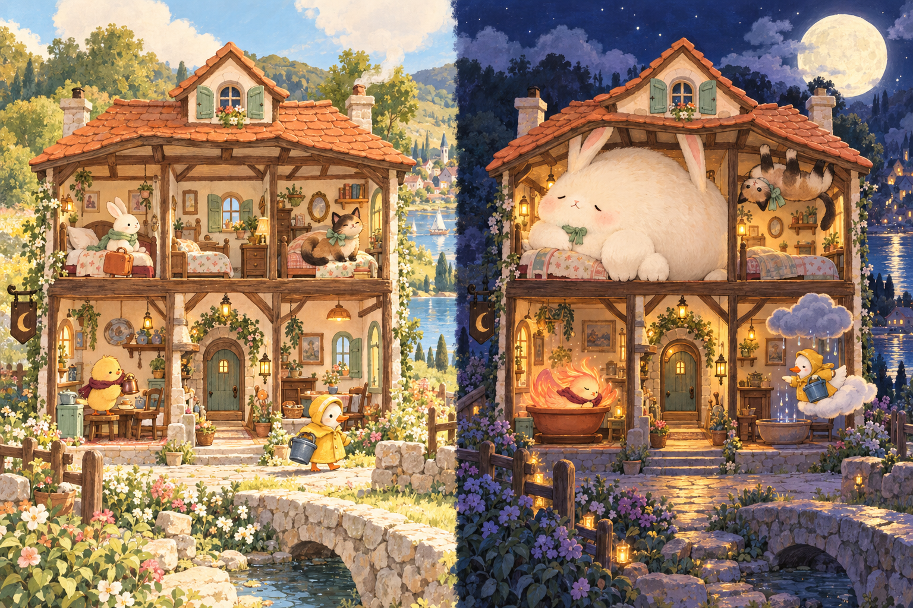
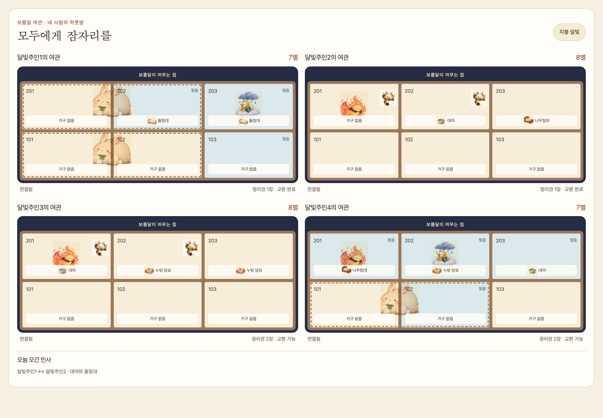

# 보름달 여관 · 디지털 게임

2026-10-10 · 새 경기 규칙 `balanced-1`

귀여운 낮 손님이 보름달에 본모습을 드러내는 **4인·한 번의 밤** 게임이다. 홈의 **보름달 여관 열기**에서 참가, 드래프트, 배치, 거래, 점수와 재경기를 진행한다. 수치 결함을 조정해 사람의 플레이테스트를 할 수 있는 시제품으로 연결했다. [밸런스 비교와 남은 검증](./moonlit-inn-balance.md)을 함께 읽는다.

## 한 판의 흐름

1. 호스트가 방을 만들고 네 명이 닉네임으로 참가한다. 휴대폰의 개인 화면과 TV 또는 휴대폰의 공개 화면을 사용할 수 있다.
2. 손님·가구 꾸러미 세 개 중 하나를 고른다. 모두 선택하면 획득한 꾸러미를 공개하고 나머지를 왼쪽 이웃에게 전달한다. 두 번 선택하고 마지막 하나는 자동으로 받는다.
3. 낮에는 여섯 방의 손님과 가구를 자유롭게 배치한다. 손님은 현관, 가구는 수납함에도 둘 수 있다. 두 달빛 예보의 예상 점수를 함께 확인한다.
4. 전원 준비 후 6초 동안 변신하고 시작 때 정해진 지붕 달빛/정원 안개를 공개한다. 연출 건너뛰기와 축소 모션을 지원한다.
5. 밤에는 정리권 두 장으로 손님 이동, 가구 이동/자리 교환 또는 이웃과 1:1 거래를 한다. 거래는 양쪽 한 장씩, 밤마다 각자 한 번이며 양측이 받을 자리를 선택한다.
6. 모두 잠자리를 확정하면 별점과 공동 우승을 표시한다. 호스트가 공개 화면에서 같은 사람들과 새 경기를 시작할 수 있다.

낮 60초·밤 90초는 기획상의 진행 목표다. 현재 버전은 강제 타임아웃으로 선택하거나 준비를 대신 확정하지 않는다.

## `balanced-1` 규칙

| 손님 | 공간과 수면 조건 | 기본 별 | 부탁/가구 보너스 |
| --- | --- | ---: | --- |
| 솜솜 · 토끼 | 같은 층 바닥의 나란한 두 칸 | 2 | 마른 담요 +2 또는 마른 나무침대 +1, 중복 불가 |
| 후추 · 불새 | 바닥 한 칸, 마른 나무침대와는 잠들지 못함 | 2 | 돌침대 +2; 비가 닿으면 나무침대에서 수면 가능 |
| 모카 · 고양이 | 천장 한 칸 | 2 | 같은 방의 잠든 바닥 룸메이트 +1, 마른 나무침대 +1, 합산 가능 |
| 보슬 · 구름 | 바닥 한 칸, 자기 방과 상하좌우에 비 | 2 | 같은 방 대야 +2; 대야가 주변 비를 막지는 않음 |

방마다 바닥·천장·가구 슬롯이 하나씩 있다. 현관 손님과 잠들지 못한 손님은 모든 별/보너스가 0이고, 수납함 가구는 효과가 없다. 지붕 달빛은 위층, 정원 안개는 아래층의 잠든 손님마다 +1이며 **여관당 최대 +1**이다.

경기 상태에 규칙 버전을 저장한다. 기존 `playtest-1` 상태는 솜솜 3별·고양이 나무침대 보너스 없음·달빛 상한 +2를 그대로 계산한다. 새 경기와 재경기는 `balanced-1`로 시작하며 카드 안내·예상 점수·거래 미리 보기·최종 결과가 해당 경기의 버전을 사용한다.

## 정보·동시성·복구

- 손패, 확정 전 선택 카드, 공개 전 달빛 결과, 인증 ID는 개인/서버 경계 안에 둔다. 공개 투영은 허용된 필드만 구성하며 TV 토큰으로 개인 모드를 요청해도 손패를 반환하지 않는다.
- 게임 행동은 `phaseKey`와 내 `revision`을 포함한다. 이전 경기·단계·배치의 요청을 거절한다. 다른 사람 때문에 방 버전만 바뀌었다면 내 단계·revision·가능 행동과 화면 모드가 그대로일 때 같은 요청 ID로 최대 네 번 시도한다.
- 거래는 양측 물건·목적지·준비 상태·정리권·거래 여부를 검증한 뒤 한 상태 전이로 적용한다. 기존 저장소의 CAS와 요청 ID 멱등성을 사용한다. 어느 한쪽이 움직이거나 준비를 마치면 제안이 만료된다.
- 한 명이라도 연결이 끊기면 선택·배치·제안을 보관하고 진행을 멈춘다. 변신 중 끊기면 남은 시간을 재연결 뒤 이어간다. 3분 후 연결된 참가자는 승자 없이 종료할 수 있다. 재경기에는 네 명의 연결이 필요하다.
- 새로고침은 서버 상태를 복구한다. 기본 메모리 모드에서는 서버 재시작 시 방이 사라진다.

## 화면과 일러스트

원화 세 장을 [공개 에셋](../../public/games/moonlit-inn/)에 포함한다. 손님은 낮/밤 모습을 전환하고, 젖음·수면 상태와 점수 이유를 문자로도 표시한다. 휴대폰에서 물건을 선택한 뒤 방을 탭해 배치한다. 거래 미리 보기는 **교환 직후** 점수이며 남은 행동까지 최적화한 점수가 아니다.

공개 화면은 여관 네 개를 2×2로 표시한다. 1440×1000에서 네 여관이 화면에 들어가고 개인 화면은 320·390·768px에서 가로 넘침이 없다. 최종 투명 스프라이트, 표정 애니메이션과 소리는 후속 제작 범위다.

[휴대폰 밤 화면](./assets/moonlit-inn/game-mobile.png) · [휴대폰 낮 배치](./assets/moonlit-inn/game-arrange.png)

## 검증 기록

- 전체 Vitest 30파일·166개 테스트 통과. 보름달 여관 도메인·투영·방 서비스 20개와 요청 충돌·개인/공개 화면 전환 테스트 9개를 포함한다. 기존 숲길의 커버리지 100% 기준을 유지하며 보름달 여관 전체의 100% 커버리지라는 뜻은 아니다.
- 실제 점수와 시뮬레이션을 합법 배치 500개 × 예보 2개 × 규칙 버전 2개, 총 2,000개 결과로 대조했다. 독립 좌표 모델과 시뮬레이션을 22,500회 대조하고 층 대칭 7,500회를 검사했다.
- 프로젝트 ESLint 오류·경고 0건, TypeScript 검사, Next.js 16.2.11의 Turbopack production build 통과.
- production 서버에서 독립 휴대폰 화면 네 개와 TV 화면으로 참가 → 선택 → 새로고침 → 배치 → 변신 → 거래 → 소유권/정리권 → 규칙 버전/달빛 상한 → 결과 → 재경기를 검사했다. 홈·HTTP LAN과 기존 네 게임의 회귀 검사를 포함해 선택한 E2E 8개가 통과했다.

테스트: [도메인](../../src/modules/moonlit-inn/domain/reducer.test.ts), [점수 대조](../../src/modules/moonlit-inn/domain/rules.test.ts), [방 서비스](../../src/modules/room/moonlit-inn-service.test.ts), [클라이언트 충돌·개인정보 경계](../../src/modules/room/ui/moonlit-room-client.test.tsx), [네 기기 E2E](../../tests/e2e/moonlit-inn-game.spec.ts).

## 실행과 남은 범위

프로젝트의 `pnpm dev`를 실행하고 `http://localhost:3000/#moonlit-inn`에서 방을 만든다. 같은 컴퓨터에서는 서로 다른 브라우저 프로필을 사용한다. 휴대폰 참가 시에는 호스트도 PC의 LAN 주소로 접속해 초대 링크를 만든다.

사람 네 명의 협상 발견/거절 이유, 게임 길이와 재플레이의 재미, Supabase 실환경의 장시간 세션은 아직 검증하지 않았다. 낮의 최적 배치를 아는 참가자는 밤에 단독 이동으로 얻는 추가 점수가 없어 거래에 재미가 집중된다. 두 밤 구조·손님 6종·5–6인 모드는 별도 범위다.
